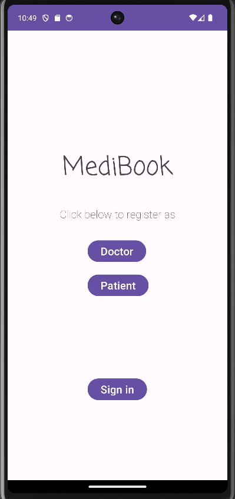
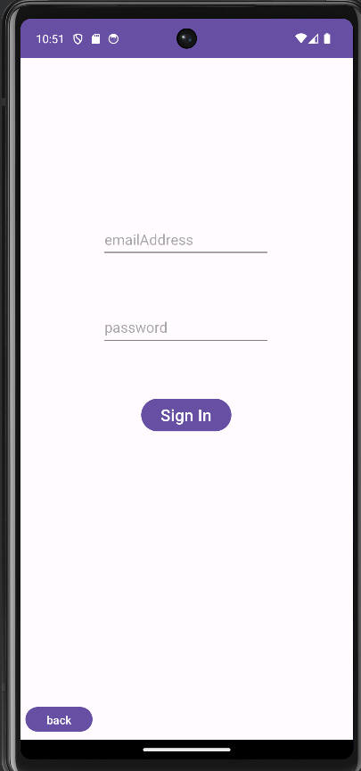
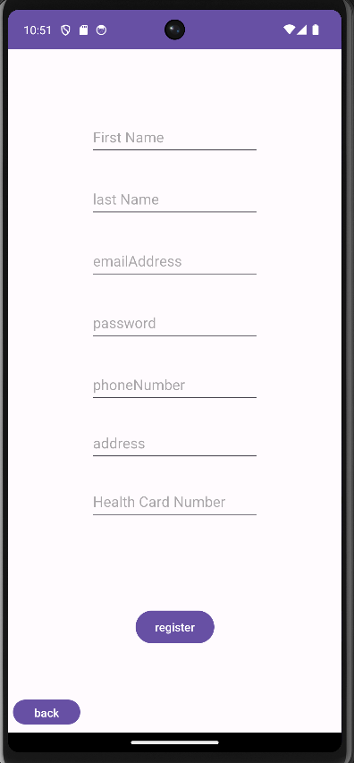
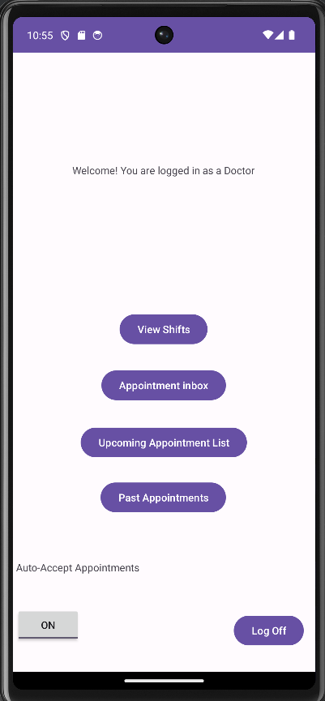
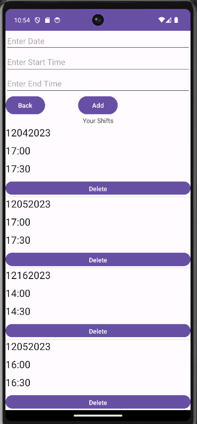
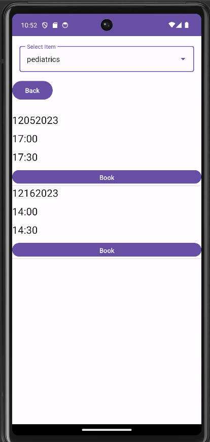
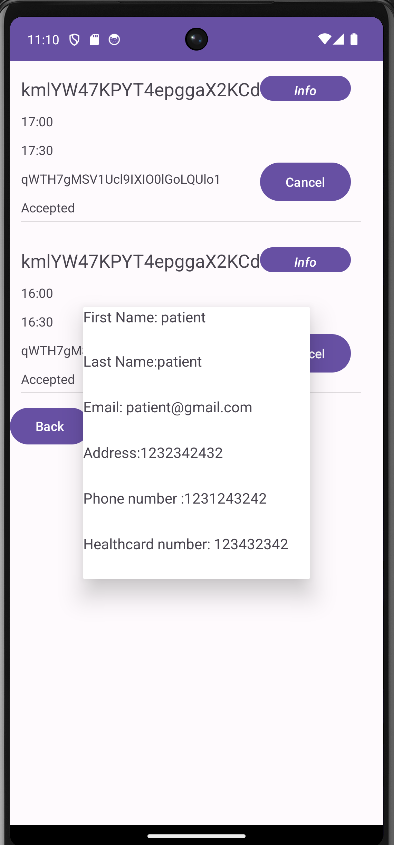
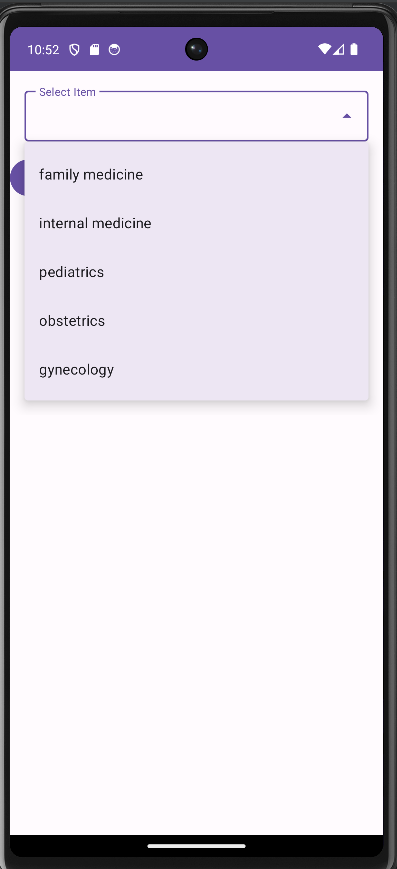
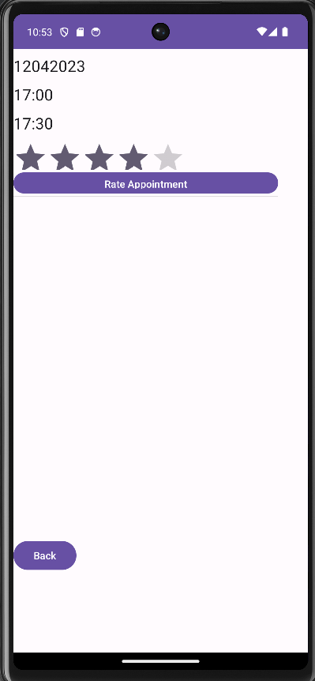

# Medibook
Administrator Login : 
  Email : admin@gmail.com
  Password : adminadmin
## About 
Medibook is a Healthcare Appointment Management System (HAMS) that streamlines the appointment booking process in a healthcare setting. The app seamlessly integrates account registrations, sign in, logging and deleting shifts, booking appointments and administrative features. 

The app incorporated role-based interactions to cater to administrators, doctors, and patients. Doctors had the ability to create shifts and appointment time slots, which patients could access in real-time to book appointments.

## Screenshots
### Home & Signin Page + Account Creation
  

### Doctor and Patient Features
  

### Some cool Features
 

## What I learned
One of the most challenging yet rewarding aspects of this project was implementing Firebase for real-time data upload and extraction. This required overcoming various obstacles, as this is our first exposure to database integration. It took hours of extensive testing to figure out how our code is interacting with the firebase data and involved collaboration and hard work from the entire team.

Beyond the technical skills honed during this project, what truly sets it apart is the emphasis on effective collaboration and communication. As the group leader, I was tasked with working ahead, planning the team's next steps, and ensuring a cohesive learning experience. This experience significantly enhanced my ability to communicate ideas effectively, foster teamwork, and lead the group towards a common goal.

